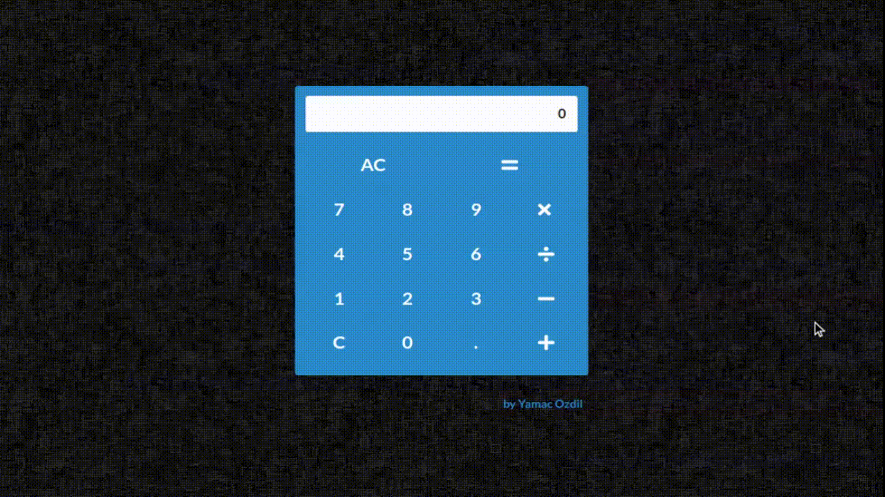

<h1 align="center">Calculator 🧮</h1>

## About



[Calculator](https://csb-e7s6g.netlify.app/) was done for Front End Development Libraries Certification at [freeCodeCamp](https://www.freecodecamp.org). At it's core it uses React and Semantic UI for simple visuals and Animate.style for initial css animations!


### ✨ [Demo](https://csb-e7s6g.netlify.app/)

## Install

```sh
npm install
```

## Usage

```sh
npm run start
```

## Run tests

```sh
npm run test
```

## Author

👤 **Yamac Ozdil**

* Website: yamacozdil.com
* Github: [@yozdil](https://github.com/yozdil)
* LinkedIn: [@yamac-ozdil](https://linkedin.com/in/yamac-ozdil)
